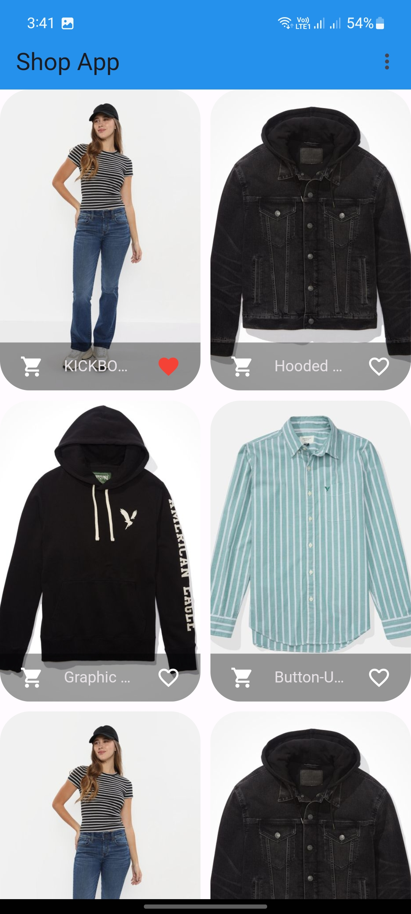
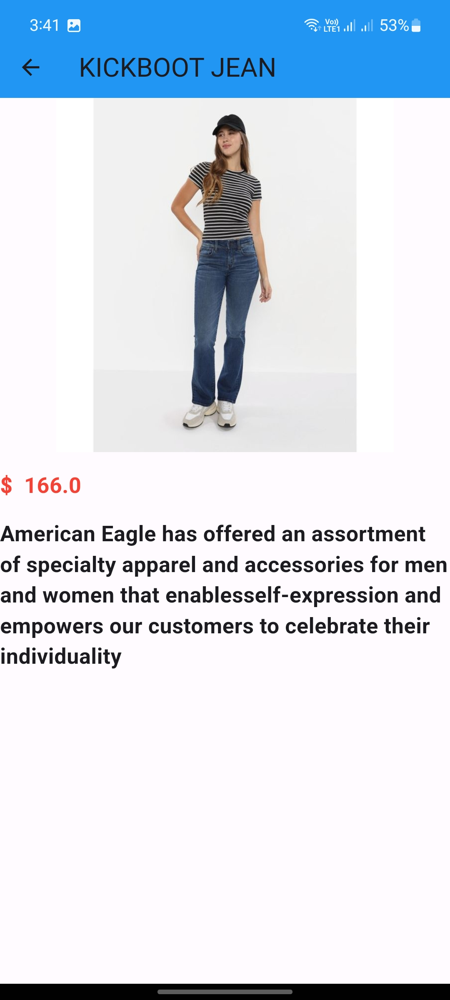

# shoping

Shopping App with Provider deal with Sqlite  like Shopping part in E-commerce App

# about 
- [🖥] # Deal With 🖥
- [x] Deal With Provider

## Benfit👻
- [🖥] # Screens 🖥

# Screen Items 
|

# Favorite Screen 
|

# Detailes Screen 
- detailes about any item

## Dependencies 💤
 -  `provider: ^6.1.1`
